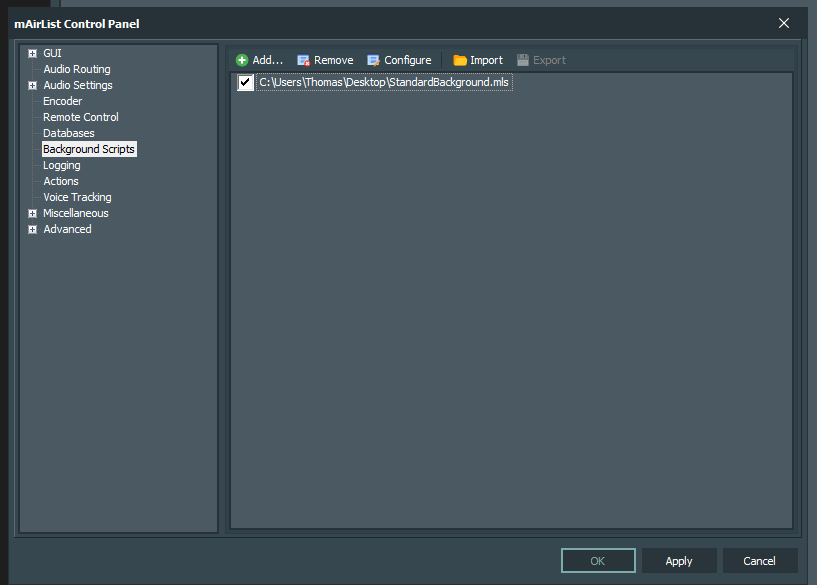
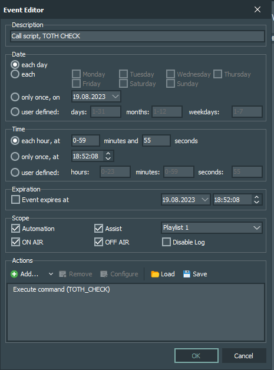
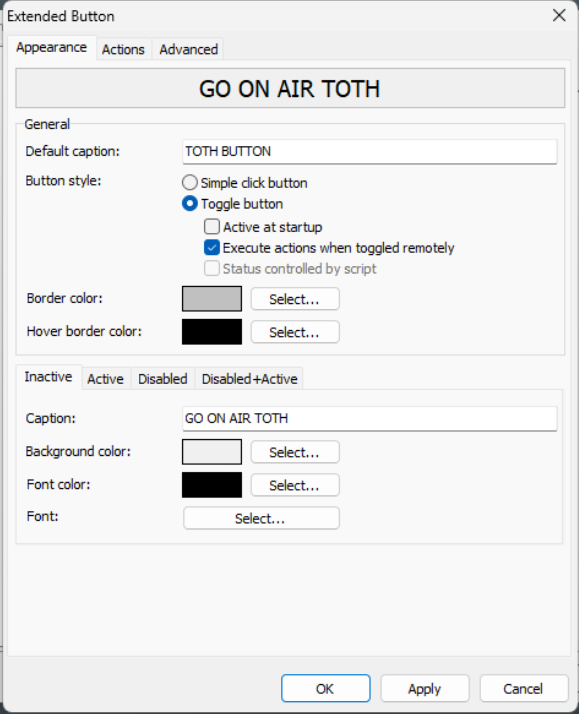
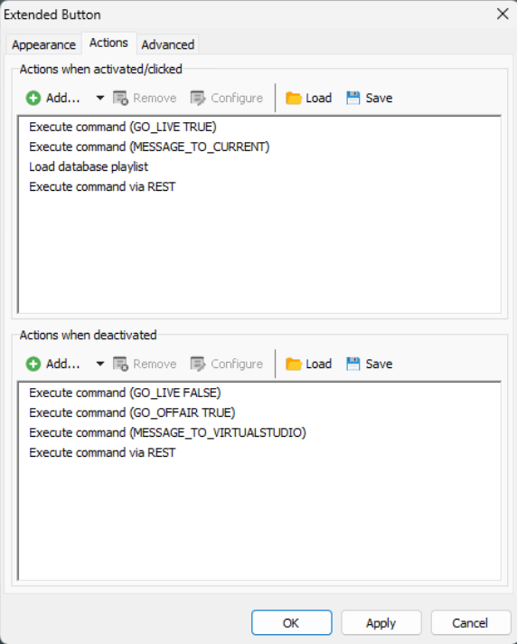
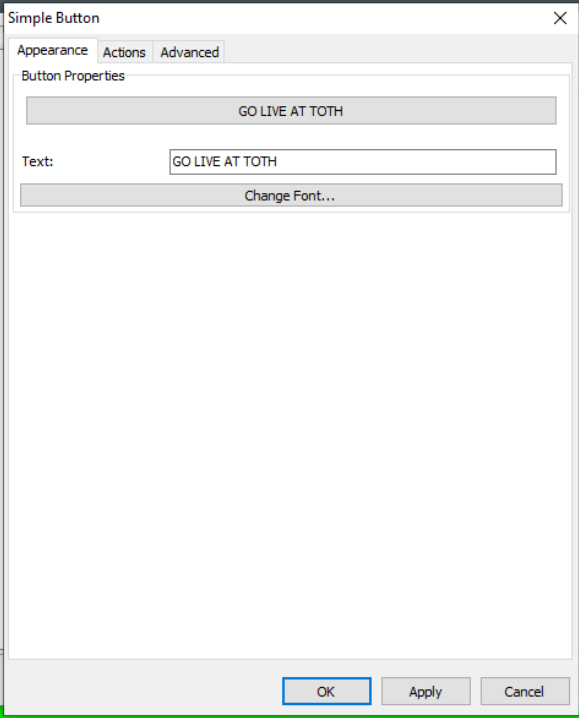
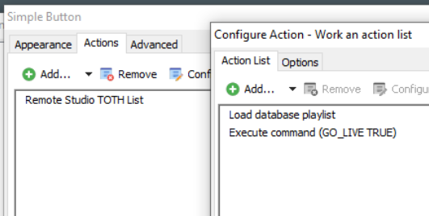

## Readme for StandardBackground.mls

1. Set up mAirlist to run StandardBackground.mls as background script.  

2. Set up event in Mairlist triggering TOTH_CHECK 

3. Add buttons in both of your studios for the script to trigger.  
3-1. GO LIVE AT TOTH/Change at TOTH 
Please add the below to your "main studio" 
 
 
For the External Commands via REST: 
When activated: Send "GO_OFFAIR TRUE" to pc going off air 
When deactivated: Send "VIRTUALSTUDIO_TOTH PRESS" 

3-1. Add Button at your "virtual studio" or secondary studio.  

